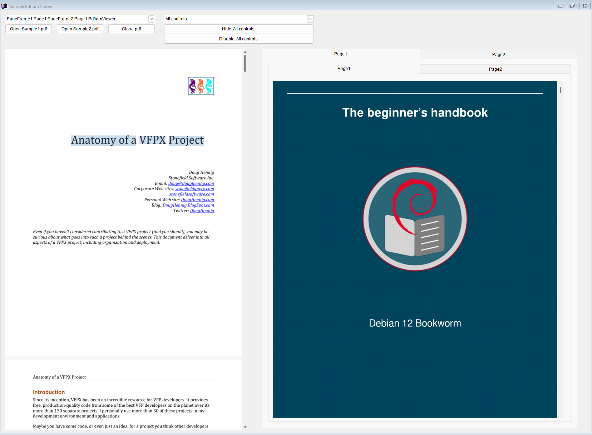

# pdfium-vfp 

pdfium-vfp is a PDF viewer control for Visual Fox Pro 9 SP2 based on [PDFium](https://pdfium.googlesource.com/pdfium/), [GDIPlusX](https://github.com/VFPX/GDIPlusX)

Main features:
* Viewing PDF files
* Text selection and copying
* Scaling (zooming in and zooming out with Ctrl + Mouse Wheel)
* Multiple control instances

### Binaries
pdfium-vfp includes [pdfium.dll](https://github.com/bblanchon/pdfium-binaries) and [system.app](https://github.com/VFPX/GDIPlusX)

### Screenshots

