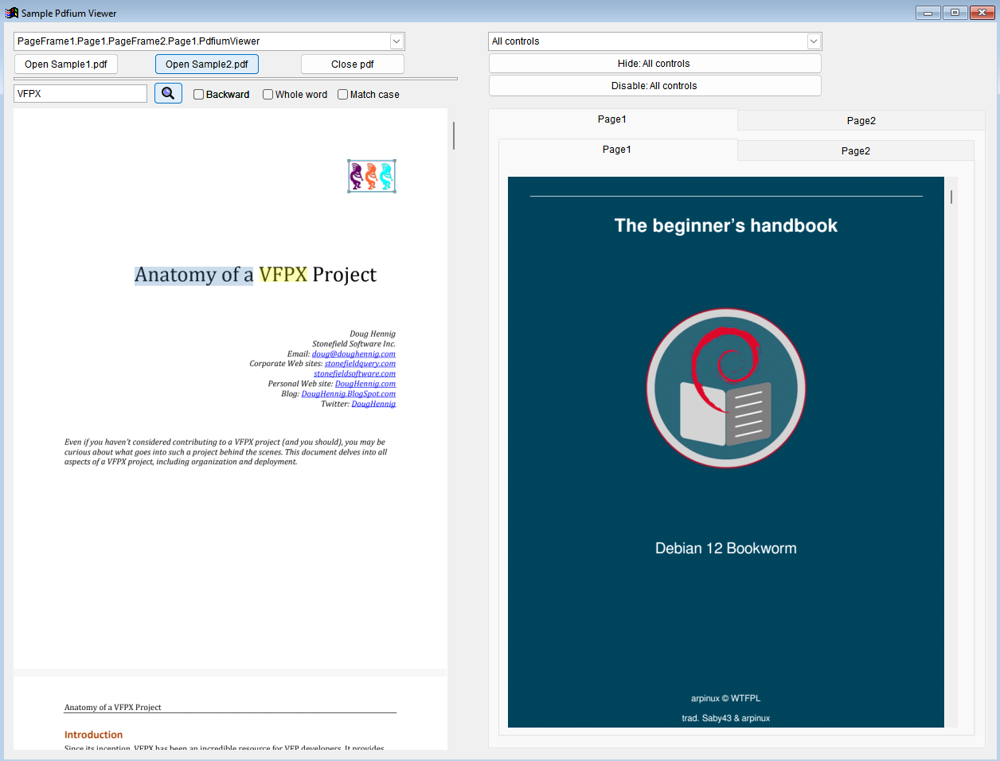
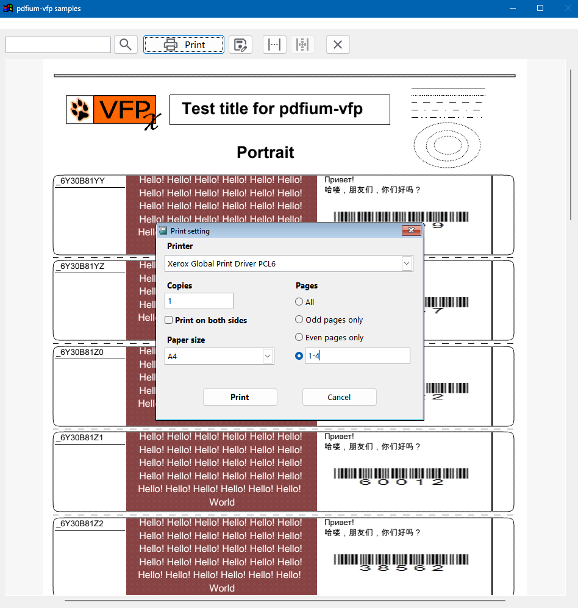

[](https://vfpx.github.io/projects/)

This and a dozen other components and tools are provided to you by <a href="https://vfpx.github.io/">VFPX community</a> 

[](https://github.com/dmitriychunikhin/pdfium-vfp/releases/latest/)
[](.github/Tests/out.jacoco.xml)
[](ChangeLog.md)
[](ChangeLog_CN.md)

# pdfium-vfp 
[English](README.md) | [简体中文](README_CN.md)

pdfium-vfp is a open source PDF viewer control and ReportOutput + ReportPreview implementation for Visual Fox Pro 9 SP2 and VFP Advanced based on 
* [PDFium](https://pdfium.googlesource.com/pdfium)
* [PDFium binaries](https://github.com/bblanchon/pdfium-binaries)
* [HarfBuzz](https://github.com/harfbuzz/harfbuzz) (hb-subset)
* [DirectWrite](https://learn.microsoft.com/ru-ru/windows/win32/directwrite/direct-write-portal)
* [zlib](https://www.zlib.net/)

## Table of contents
* [Features](#features)
* [Minumum system requirements](#minumum-system-requirements)
* [Getting started](#getting-started)
* [Sample VFP project](#sample-vfp-project)
* [Known issues](#known-issues)
* [Basic usage of PdfiumViewer](#basic-usage-of-pdfiumviewer)
* [Basic usage of PdfiumReport](#basic-usage-of-pdfiumreport)
* [PdfiumReport.app and private fonts](#pdfiumreportapp-and-private-fonts)
* [PdfiumReport PDF metadata and password protection](#pdfiumreport-pdf-metadata-and-password-protection)
* [Filling PDF forms programmatically](#filling-pdf-forms-programmatically)
* [Binaries](#binaries)
* [VFP environment effects](#vfp-environment-effects)

## Features:
* Viewing PDF files
* Interactive form filling
* Text selection and copying
* Text searching
* Printing PDF
* Multiple control instances
* VFP frx reports previewing, printing and saving (as pdf) without High DPI pain in the neck
* Export VFP frx reports to docx (OOXML strict format)
* Frx report rendering supports private fonts (non system fonts)
* Frx report rendering supports dynamics and rotation properties
* Supports VFP Advanced x86 and x64

## Minumum system requirements
### Windows
* Windows Vista SP 2
* 1 core CPU
* 1024 MB of RAM

### Linux
* Tested on Debian (12 bookworm) and Alt (kworkstation 10) distros
* Wine 9.0


## Getting started

### Thor 
* Install Thor https://github.com/VFPX/Thor
* Run VFP and open Thor / Check for updates in VFP system menu 
* Download pdfium-vfp component
* Open Thor / Folders / Components in VFP system menu and then open pdfium-vfp folder in Explorer
* Read Basic Usage section on this page

### Windows (full sources with samples)
* git clone https://github.com/dmitriychunikhin/pdfium-vfp
* open and explore Sample/sample.pjx

### Linux  (full sources with samples)
* Check wine version
```bash
> wine --version
wine-9.0
```

* Clone repo and run sample.exe 

```bash
cd ~
git clone https://github.com/dmitriychunikhin/pdfium-vfp
cd ~/pdfium-vfp/Sample
WINEDLLOVERRIDES="gdiplus=n" wine sample.exe

#wine built-in gdiplus.dll doesn't work as expected, thus it has to be overrided. You can take one from C:/Windows/SysWOW64 folder.
```


## Sample VFP project
Open sample.pjx project from `pdfium-vfp/Sample` folder or just run Sample/sample.exe






## Known issues
* PdfiumViewer doesn't support page rotation, bookmarks, annotations and active hyperlinks
* Fallback font in report previewer is Helvetica with no chance to change it
* Report previewer can deal with ttf/ttc fonts only, non ttf font (bitmap fonts) and symbol fonts are rendered as images
* Interface language always is your system language 


## Basic usage of PdfiumViewer
1) Copy pdfium-vfp.vcx, pdfium-vfp.vct from Release folder to your project folder
2) <br/>
    <b>VFP:</b> Copy dependency binaries <i>pdfium.dll, pdfium-vfp.dll</i> from <i>Release</i> folder to your project's folder
    
    <b>VFPA x64:</b> Copy dependency binaries <i>pdfium64.dll, pdfium-vfp64.dll</i> from <i>Release</i> folder to your project's folder

3) Add PdfiumViewer object from pdfium-vfp.vcx on the form

4) Open PDF file
```foxpro
Thisform.PdfiumViewer.OpenPdf("some.pdf")
```

5) Print document
```foxpro
Thisform.PdfiumViewer.PrintDocument()
```

6) Save document to the file
```foxpro
Thisform.PdfiumViewer.SaveDocument("c:\myfolder\mydoc.pdf")
```

7) Close PDF file
```foxpro
Thisform.PdfiumViewer.ClosePdf()
```

## Basic usage of PdfiumReport
1) Copy PdfiumReport.app from Release folder to your project folder
2) <br/>
    <b>VFP:</b> Copy dependency binaries <i>pdfium.dll, pdfium-vfp.dll</i> from <i>Release</i> folder to your project's folder
    
    <b>VFPA x64:</b> Copy dependency binaries <i>pdfium64.dll, pdfium-vfp64.dll</i> from <i>Release</i> folder to your project's folder

More examples can be found at `pdfium-vfp/Sample/sample.scx`

### Standalone

```foxpro
LOCAL loPdfiumReport
DO pdfiumreport.app WITH .F., loPdfiumReport, .T. && Create new instance of PdfiumReport
* DON'T USE NewObject("PdfiumReport", "pdfium-vfp.vcx", "pdfiumreport.app") to create new instance of PdfiumReport

*******************************************
* Report previewing
*******************************************
loPdfiumReport.SaveAs_Filename = "myreport" && Filename suggestion for "save as" dialog, not mandatory

loPdfiumReport.BatchBegin()

REPORT FORM Report1.frx OBJECT loPdfiumReport
REPORT FORM Report2.frx OBJECT loPdfiumReport PREVIEW

loPdfiumReport.BatchEnd()

** OR **

REPORT FORM Report1.frx OBJECT loPdfiumReport NOPAGEEJECT
REPORT FORM Report2.frx OBJECT loPdfiumReport PREVIEW


*******************************************
* Saving report output to the file
*******************************************
loPdfiumReport.BatchBegin()

REPORT FORM Report1.frx OBJECT loPdfiumReport 
REPORT FORM Report2.frx OBJECT loPdfiumReport TO FILE "some.pdf"

loPdfiumReport.BatchEnd()


** OR **

REPORT FORM Report1.frx OBJECT loPdfiumReport NOPAGEEJECT 
REPORT FORM Report2.frx OBJECT loPdfiumReport TO FILE "some.pdf"

```

### as _REPORTOUTPUT

```foxpro
SET REPORTBEHAVIOR 90

LOCAL lSave_REPORTOUTPUT
lSave_REPORTOUTPUT = _REPORTOUTPUT

TRY
    _REPORTOUTPUT = "pdfiumreport.app"

    DO pdfiumreport.app WITH .T. && Initialization (mandatory) / Execute on initialization step of your application

    *******************************************
    * Report previewing
    *******************************************
    REPORT FORM Report1.frx NOPAGEEJECT 
    REPORT FORM Report2.frx PREVIEW

    *******************************************
    * Saving report output to the file
    *******************************************
    REPORT FORM Report1.frx NOPAGEEJECT
    REPORT FORM Report2.frx TO FILE "some.pdf"

    DO pdfiumreport.app WITH .F. && Release / Execute on release step of your application
        
FINALLY    
    _REPORTOUTPUT = lSave_REPORTOUTPUT
ENDTRY
```

## PdfiumReport.app and private fonts
Private font is a font that is not installed in system in your development, testing or production environment

Sample can be found in `pdfium-vfp/Sample/Sample.scx` in `cmdReport.Click`

### Standalone
```foxpro
* Manually create Pdfium environment and add your private fonts in Pdfium_env.PrivateFonts collection

LOCAL loPdfiumEnv
loPdfiumEnv = NEWOBJECT("Pdfium_env", "pdfium-vfp.vcx", "pdfiumreport.app") 
* You can omit "pdfiumreport.app" from NewObject 3rd argument if you have pdfium-vfp.vcx included in your project

* parameters: font file path, font face name
loPdfiumEnv.PrivateFonts.Add("Fonts\KurintoSansSC-Rg.ttf", "Kurinto Sans SC")

* Pass pdfium_env object as the first parameter of DO PdfiumReport.app command
LOCAL loPdfiumReport
DO pdfiumreport.app WITH loPdfiumEnv, loPdfiumReport, .T. && Create new instance of PdfiumReport


* Run report with private fonts
REPORT FORM Report1.frx OBJECT loPdfiumReport PREVIEW
```

### as _REPORTOUTPUT
```foxpro
* Manually create Pdfium environment and add your private fonts in Pdfium_env.PrivateFonts collection

LOCAL loPdfiumEnv
loPdfiumEnv = NEWOBJECT("Pdfium_env", "pdfium-vfp.vcx", "pdfiumreport.app")
* You can omit "pdfiumreport.app" from NewObject 3rd argument if you have pdfium-vfp.vcx included in your project

* parameters: font file path, font face name
loPdfiumEnv.PrivateFonts.Add("Fonts\KurintoSansSC-Rg.ttf", "Kurinto Sans SC")

* Pass pdfium_env object as the first parameter of PdfiumReport.app initialization routine
DO pdfiumreport.app WITH loPdfiumEnv

* Run report with private fonts
REPORT FORM Report1.frx PREVIEW
```


## PdfiumReport PDF metadata and password protection

```foxpro

LOCAL loPdfiumReport

loPdfiumReport = Application.PdfiumReport
* or *
DO pdfiumreport.app WITH .F., loPdfiumReport, .T. && Create new instance of PdfiumReport


********************************************************************************************** 
* Application.PdfiumReport is global variable created by pdfiumreport.app on initialization
**********************************************************************************************

loPdfiumReport.SaveAs_Filename = "myreport" && Filename suggestion for save as dialog in preview mode, not mandatory

* PDF metadata setup sample, setting up metadata is not mandatory 
loPdfiumReport.SaveAs_PDFMeta.Author = "Me"
loPdfiumReport.SaveAs_PDFMeta.Creator = "Pdfium-vfp sample app"
loPdfiumReport.SaveAs_PDFMeta.Keywords = "pdfium-vfp,sample"
loPdfiumReport.SaveAs_PDFMeta.Subject = "report1.frx and report2.frx batch"
loPdfiumReport.SaveAs_PDFMeta.Title = "Sample report"

* PDF password protection, input any owner password and user password for testing
loPdfiumReport.SaveAs_PDFMeta.OwnerPassword = "" && Owner Password protects permissions of the doc. Mandatory if User Password was set. Owner password mustn't be equal to user password
loPdfiumReport.SaveAs_PDFMeta.UserPassword = "" && This password user inputs when open pdf file

* PDF reader permissions (matter only if Owner passwords is set)
loPdfiumReport.SaveAs_PDFMeta.Permit_Print = .T. && Allow to print document
loPdfiumReport.SaveAs_PDFMeta.Permit_Edit_All = .T. && Allow to edit contents other than annotations and forms
loPdfiumReport.SaveAs_PDFMeta.Permit_Copy = .T. && Allow copy contents of the document
loPdfiumReport.SaveAs_PDFMeta.Permit_Edit = .T. && Allow to make annotations and fill forms
**********************************************************************************************

```

## Filling PDF forms programmatically
PdfiumViewer gives a read-write access to form fields values, and read-only access to other field's properties like name, options and etc, adding new fields is not allowed.

### PdfiumViewer::GetFormFieldsCount()

Returns number of fields in PDF form

### PdfiumViewer::GetFormField(tcFieldNameOrIndex as String)

Accepts PDF form field name in UTF-16LE or 1-based field index, returns object if field exists otherwise returns .F..

Return object is a clone of current internal state of a field in document, thus setting values of object properties doesn't change anything inside document.

__Return object fields:__
* ___Name___: field name in UTF-16LE encoding
* ___Type___: field type, string (ANSI encoding)

    values: CheckBox, ComboBox, ListBox, Button, TextBox, OptionGroup, Signature, Unknown

* ___Value___: value of a field, the property contains 
    * String value (UTF-16LE) for TextBox, ComboBox
    * Logical value for CheckBox
    * Numeric value for OptionGroup that is 1-based index of selected RadioButton in the group
    * NULL for Button
* ___ValueRaw___: unformatted field value in PDF (String, UTF-16LE encoding)
* ___GroupItems___: Collection of items for OptionGroup fields. Contains objects with props:
    * "Value" String (UTF-16LE): RadioButton internal value in PDF
    * "PageIndex": 1-based index of a page where RadioButton widget is located
    * "AnnotIndex": 1-based index of a RadioButton widget annotation
* ___Options___: Collection of options for ComboBox and ListBox fields

    Contains objects with props "Label" String (UTF-16LE), "IsSelected" Logical

* ___PageIndex___: 1-based index of a page where field's widget is located
* ___AnnotIndex___: 1-based index of a field's widget annotation

### PdfiumViewer::SetFormFieldValue(tcFieldNameOrIndex as String, tvFormFieldValue)
Sets value of a field. Accepts two parameters:

* field name in UTF-16LE or 1-based form field index
* field value of type String (UTF-16LE) for textbox, combobox, Logical for checkbox, Numeric 1-based index of selected RadioButton for OptionGroup; Returns .T. if a value was set successfully otherwise returns .F.

### Code samples
```
Thisform.NewObject("oPdfiumViewer", "PdfiumViewer", "pdfium-vfp.vcx")
LOCAL loFormField
WITH Thisform.oPdfiumViewer
    * TextBox
    m.loFormField = .GetFormField(STRCONV('teacher_name', 5))
    IF VARTYPE(m.loFormField) = "O"
        ? STRCONV(m.loFormField.Value, 6) && TextBox value is a string in UTF-16LE
        IF NOT .SetFormFieldValue(STRCONV('teacher_name', 5), STRCONV('John Doe', 5))
            ? teacher_name value wasn't set
        ENDIF
    ENDIF

    * ComboBox
    m.loFormField = .GetFormField(STRCONV('Combo1', 5))
    IF VARTYPE(m.loFormField) = "O"
        ? STRCONV(m.loFormField.Value, 6) && ComboBox value is a string in UTF-16LE
        IF NOT .SetFormFieldValue(STRCONV('Combo1', 5), 10) && This selects 10th item in combobox
            ? Combo1 value wasn't set
        ENDIF
    ENDIF

    * CheckBox
    m.loFormField = .GetFormField(STRCONV('checkbox', 5))
    IF VARTYPE(m.loFormField) = "O"
        ? m.loFormField.Value && CheckBox value is of Logical type
        IF NOT .SetFormFieldValue(STRCONV('checkbox', 5), .T.)
            ? checkbox value wasn't set
        ENDIF
    ENDIF

    * OptionGroup
    m.loFormField = .GetFormField(STRCONV('radiobutton', 5))
    IF VARTYPE(m.loFormField) = "O"
        ? m.loFormField.Value && OptionGroup value is of Numeric type
        IF NOT .SetFormFieldValue(STRCONV('radiobutton', 5), 2) && This selects 2nd RadioButton in OptionGroup
            ? OptionGroup value wasn't set
        ENDIF
    ENDIF
ENDWITH
```

## Binaries
What binaries exactly do you need to run all the stuff (or your own latest version of it)
### VFP
* [pdfium-vfp/Release/pdfium.dll](Release/pdfium.dll)
* [pdfium-vfp/Release/pdfium-vfp.dll](Release/pdfium-vfp.dll)

### VFPA x64
* [pdfium-vfp/Release/pdfium64.dll](Release/pdfium64.dll)
* [pdfium-vfp/Release/pdfium-vfp64.dll](Release/pdfium-vfp64.dll)


## VFP environment effects
* Adds Application.Pdfium_instance_count property
* Adds Application.PdfiumReportEnv property as pdfium_env of pdfium-vfp
* Adds Application.PdfiumReport property as pdfiumreport of pdfium-vfp
* Declares WIN32API and GDIPlus functions via WinApi_* pattern (with aliases)
* Declares pdfium.dll functions via FPDF_* pattern (with aliases)
* Declares pdfium-vfp.dll functions via VFPDF_* pattern (with aliases)
* Doesn't perform CLEAR DLLS 
* Adds fonts from Pdfium_env.PrivateFonts collection to GDIPlus PrivateFontCollection (https://learn.microsoft.com/en-us/dotnet/api/system.drawing.text.privatefontcollection?view=net-8.0)
