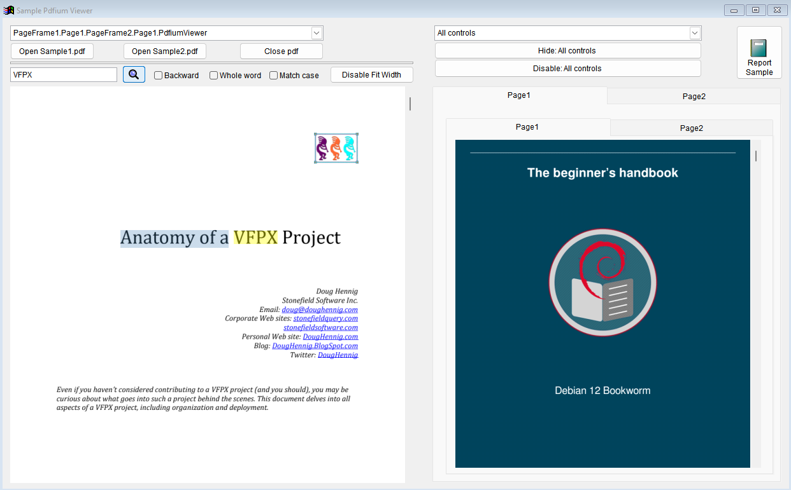

<a href="https://vfpx.github.io/projects/"></a>

本工具和其他很多种组件工具由 <a href="https://vfpx.github.io/">VFPX 社区</a> 提供。

# pdfium-vfp 
[English](README.md) | [简体中文](README_CN.md)

pdfium-vfp 是一款开源 PDF 查看控件，同时也是 Visual Fox Pro 9 SP2 和 VFP Advanced 的 ReportOutput + ReportPreview 实现，它基于 
* [PDFium](https://pdfium.googlesource.com/pdfium/) 
* [libHaru](https://github.com/libharu/) 
* [GDIPlusX](https://github.com/VFPX/GDIPlusX)
* [DirectWrite](https://learn.microsoft.com/zh-cn/windows/win32/directwrite/direct-write-portal)


### 功能:
* 查看 PDF 文件
* 文本选择与复制
* 文本搜索
* 打印 PDF
* 多个控件实例
* VFP frx 报表的预览、打印和保存(PDF 格式)无需忍受高 DPI 带来的痛苦
* Frx 报表渲染支持专用字体（非系统字体）
* Frx 报表渲染支持动态和旋转属性
* 支持 VFP Advanced 32位/64位 

### 系统最低要求
#### Windows
* Windows Vista SP 2
* 单核 CPU
* 1G 内存

#### Linux
* 已在 Debian（12 bookworm）和 Alt（kworkstation 10）发行版上进行测试
* Wine 9.0


### 入门

#### Thor 
* 安装 Thor https://github.com/VFPX/Thor
* 运行 VFP 并点击菜单项 Thor / Check for updates
* 下载 pdfium-vfp 组件
* 点击菜单项 Thor / Folders / Components 并在文件资源管理器中打开 pdfium-vfp 文件夹
* 阅读本页的“基本用法”部分

#### Windows (带有示例的完整源代码)
* 使用 git 工具克隆 https://github.com/dmitriychunikhin/pdfium-vfp
* 运行 pdfium-vfp/Sample/sample.exe
* 打开项目 Sample/sample.pjx

#### Linux  (带有示例的完整源代码)
* 检查 wine 版本
```bash
wine --version
> wine-9.0
```

* 克隆仓库并运行 sample.exe 

```bash
cd ~
git clone https://github.com/dmitriychunikhin/pdfium-vfp
cd ~/pdfium-vfp/Sample
WINEDLLOVERRIDES="gdiplus=n" wine sample.exe

#wine 内置的 gdiplus.dll 不能按预期工作，因此必须予以覆盖。你可以从 pdfium-vfp/Sample 文件夹中提取一个。
```


### Sample VFP 项目
打开 `pdfium-vfp/Sample` 文件夹中的 sample.pjx 项目，或直接运行 Sample/sample.exe（包含所有必要的二进制文件）。




### 已知问题
* PdfiumViewer 不支持页面旋转、书签、注释和活动超链接
* 预览报表时如果报表使用了组件不支持的字体，则被替换为使用 Helvetica 字体，并且不能进行更改
* 报表预览只能处理 ttf/ttc 字体，非 ttf 字体（fon）将以图像形式呈现
* 界面语言总是系统语言


### PdfiumViewer 的基本用法
1) 将 Source 文件夹中的 pdfium-vfp.vcx 和 pdfium-vfp.vct 复制到项目文件夹中
2) <br/>
    <b>VFP:</b> 将 <i>Source</i> 文件夹中的二进制依赖文件 <i>pdfium.dll、pdfium-vfp.dll、system.app</i> 复制到项目文件夹中
    
    <b>VFPA x64:</b> 将 <i>Source</i> 文件夹中的二进制依赖文件 <i>pdfium64.dll、pdfium-vfp64.dll、system.app</i> 复制到项目文件夹中

3) 在表单中添加 pdfium-vfp.vcx 中的 PdfiumViewer 对象

4) 打开 PDF 文件
```foxpro
Thisform.PdfiumViewer.OpenPdf("some.pdf")
```

5) 打印文档
```foxpro
Thisform.PdfiumViewer.PrintDocument()
```

6) 另存文档
```foxpro
Thisform.PdfiumViewer.SaveDocument("c:\myfolder\mydoc.pdf")
```

7) 关闭 PDF 文件
```foxpro
Thisform.PdfiumViewer.ClosePdf()
```


### PdfiumReport 的基本用法
1) 将 Source 文件夹中的 PdfiumReport.app 复制到项目文件夹中
2) <br/>
    <b>VFP:</b> 将 <i>Source</i> 文件夹中的二进制依赖文件 <i>libhpdf.dll、pdfium.dll、pdfium-vfp.dll、system.app</i> 复制到项目文件夹中
    
    <b>VFPA x64:</b> 将 <i>Source</i> 文件夹中的二进制依赖文件 <i>libhpdf64.dll、pdfium64.dll、pdfium-vfp64.dll、system.app</i> 复制到项目文件夹中

更多示例请参见 `pdfium-vfp/Sample/sample.scx`

#### 单独使用 

```foxpro
LOCAL loPdfiumReport
loPdfiumReport = NEWOBJECT("PdfiumReport", "pdfium-vfp.vcx", "pdfiumreport.app")

*******************************************
* 报表预览
*******************************************
loPdfiumReport.SaveAs_Filename = "myreport" && 用于“另存为”对话框的建议文件名，它不是强制性的

loPdfiumReport.BatchBegin()

REPORT FORM Report1.frx OBJECT loPdfiumReport
REPORT FORM Report2.frx OBJECT loPdfiumReport PREVIEW

loPdfiumReport.BatchEnd()

** 或 **

REPORT FORM Report1.frx OBJECT loPdfiumReport NOPAGEEJECT
REPORT FORM Report2.frx OBJECT loPdfiumReport PREVIEW


*******************************************
* 将报表输出结果保存到文件中
*******************************************
loPdfiumReport.BatchBegin()

REPORT FORM Report1.frx OBJECT loPdfiumReport 
REPORT FORM Report2.frx OBJECT loPdfiumReport TO FILE "some.pdf"

loPdfiumReport.BatchEnd()


** 或 **

REPORT FORM Report1.frx OBJECT loPdfiumReport NOPAGEEJECT 
REPORT FORM Report2.frx OBJECT loPdfiumReport TO FILE "some.pdf"

```

#### 作为 _REPORTOUTPUT 

```foxpro
SET REPORTBEHAVIOR 90

LOCAL lSave_REPORTOUTPUT
lSave_REPORTOUTPUT = _REPORTOUTPUT

TRY
    _REPORTOUTPUT = "pdfiumreport.app"

    DO pdfiumreport.app WITH .T. && 初始化(必须)/在应用程序初始化步骤时执行

    *******************************************
    * 报表预览
    *******************************************
    REPORT FORM Report1.frx NOPAGEEJECT 
    REPORT FORM Report2.frx PREVIEW

    *******************************************
    * 将报表输出结果保存到文件中
    *******************************************
    REPORT FORM Report1.frx NOPAGEEJECT
    REPORT FORM Report2.frx TO FILE "some.pdf"

    DO pdfiumreport.app WITH .F. && 应用程序结束时执行
        
FINALLY    
    _REPORTOUTPUT = lSave_REPORTOUTPUT
ENDTRY
```

### PdfiumReport.app 和专用字体
专用字体是指在开发、测试或生产环境中未安装在系统中的字体。

示例可在`pdfium-vfp/Sample/Sample.scx`中的`cmdReport.Click`找到。

#### 单独使用
```foxpro
* 手动创建 Pdfium 环境，并在 Pdfium_env.PrivateFonts 集合中添加您的专用字体

LOCAL loPdfiumEnv
loPdfiumEnv = NEWOBJECT("Pdfium_env", "pdfium-vfp.vcx", "pdfiumreport.app")

* 参数：字体文件路径、字体名称
loPdfiumEnv.PrivateFonts.Add("Fonts\KurintoSansSC-Rg.ttf", "Kurinto Sans SC")

* 将 pdfium_env 对象作为 PdfiumReport 构造函数的第一个参数传入
LOCAL loPdfiumReport
loPdfiumReport = NEWOBJECT("PdfiumReport", "pdfium-vfp.vcx", "pdfiumreport.app", loPdfiumEnv)

* 使用专用字体运行报表
REPORT FORM Report1.frx OBJECT loPdfiumReport PREVIEW
```

#### 作为 _REPORTOUTPUT
```foxpro
* 手动创建 Pdfium 环境，并在 Pdfium_env.PrivateFonts 集合中添加您的专用字体

LOCAL loPdfiumEnv
loPdfiumEnv = NEWOBJECT("Pdfium_env", "pdfium-vfp.vcx", "pdfiumreport.app")

* 参数：字体文件路径、字体名称
loPdfiumEnv.PrivateFonts.Add("Fonts\KurintoSansSC-Rg.ttf", "Kurinto Sans SC")

* 将 pdfium_env 对象作为 PdfiumReport.app 初始化例程的第一个参数传入
DO pdfiumreport.app WITH loPdfiumEnv

* 使用专用字体运行报表
REPORT FORM Report1.frx PREVIEW
```
### <a name="PDFMeta">PdfiumReport PDF 元数据和密码保护</a>

```foxpro

LOCAL loPdfiumReport

loPdfiumReport = _PdfiumReport
* 或者 *
loPdfiumReport = NEWOBJECT("PdfiumReport", "pdfium-vfp.vcx", "pdfiumreport.app")

********************************************************************************************** 
* _PdfiumReport 是由 pdfiumreport.app 在初始化时创建的全局变量
**********************************************************************************************

loPdfiumReport.SaveAs_Filename = "myreport" && 预览模式下 “另存为” 对话框的建议文件名，非强制

* PDF 元数据设置示例，元数据设置不是强制性的 
loPdfiumReport.SaveAs_PDFMeta.Author = "Me"
loPdfiumReport.SaveAs_PDFMeta.Creator = "Pdfium-vfp sample app"
loPdfiumReport.SaveAs_PDFMeta.Keywords = "pdfium-vfp,sample"
loPdfiumReport.SaveAs_PDFMeta.Subject = "report1.frx and report2.frx batch"
loPdfiumReport.SaveAs_PDFMeta.Title = "Sample report"

* PDF 密码保护，可输入任何所有者密码和用户密码进行测试
loPdfiumReport.SaveAs_PDFMeta.OwnerPassword = "" && 所有者密码用于保护文档的权限。如果设置了用户密码，则必须输入。所有者密码不能等于用户密码
loPdfiumReport.SaveAs_PDFMeta.UserPassword = "" && 用户在打开 pdf 文件时输入的密码

* PDF 阅读器权限（仅当设置了所有者密码时才有效）
loPdfiumReport.SaveAs_PDFMeta.Permit_Print = .T. && 允许打印文件
loPdfiumReport.SaveAs_PDFMeta.Permit_Edit_All = .T. && 允许编辑注释和表单之外的内容
loPdfiumReport.SaveAs_PDFMeta.Permit_Copy = .T. && 允许复制文件内容
loPdfiumReport.SaveAs_PDFMeta.Permit_Edit = .T. && 允许批注和填写表单
**********************************************************************************************

```

### 二进制文件
要运行所有程序(或您自己的最新版本)，您需要以下二进制文件：
#### VFP
* [pdfium-vfp/Source/pdfium.dll](Source/pdfium.dll)
* [pdfium-vfp/Source/pdfium-vfp.dll](Source/pdfium-vfp.dll)
* [pdfium-vfp/Source/libhpdf.dll](Source/libhpdf.dll) - for PdfiumReport.app only
* [pdfium-vfp/Source/system.app](Source/system.app)

#### VFPA x64
* [pdfium-vfp/Source/pdfium64.dll](Source/pdfium64.dll)
* [pdfium-vfp/Source/pdfium-vfp64.dll](Source/pdfium-vfp64.dll)
* [pdfium-vfp/Source/libhpdf64.dll](Source/libhpdf64.dll) - for PdfiumReport.app only
* [pdfium-vfp/Source/system.app](Source/system.app)

#### 源代码库
* [pdfium.dll](https://github.com/bblanchon/pdfium-binaries) 
* [libhpdf.dll](https://github.com/libharu/)
* [system.app](https://github.com/VFPX/GDIPlusX)


### 对 VFP 环境的影响
* 添加 Application.Pdfium_instance_count 属性
* PdfiumReport.app 声明 
```foxpro
PUBLIC _PdfiumReportEnv as pdfium_env of pdfium-vfp
PUBLIC _PdfiumReport as pdfiumreport of pdfium-vfp
```
* 通过 WinApi_* 模式（带别名）声明 WIN32API 函数
* 通过 FPDF_* 模式（带别名）声明 pdfium.dll 函数
* 通过 FPDF_* 模式（带别名）声明 pdfium-vfp.dll 函数
* 通过 HPDF_* 模式（带别名）声明 libhpdf.dll 函数
* 不执行 CLEAR DLLS 功能 
* 将 Pdfium_env.PrivateFonts 集合中的字体添加到 GDI Plus  [System.Drawing.Text.PrivateFontCollection](https://learn.microsoft.com/en-us/dotnet/api/system.drawing.text.privatefontcollection?view=net-8.0) 中
